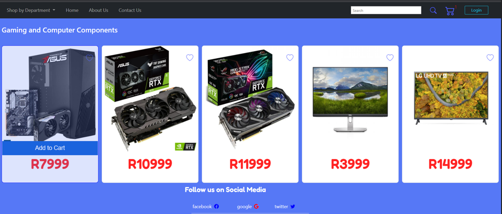
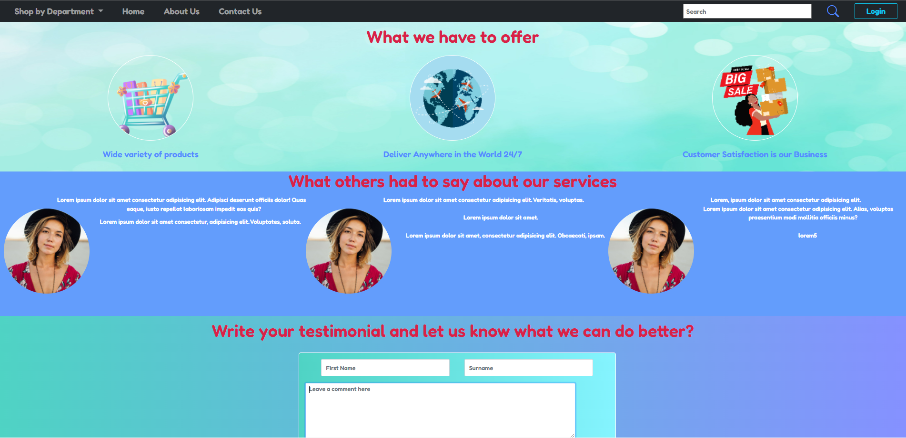
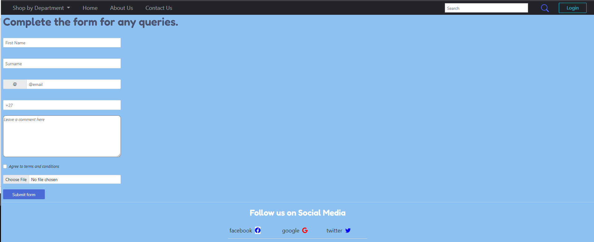
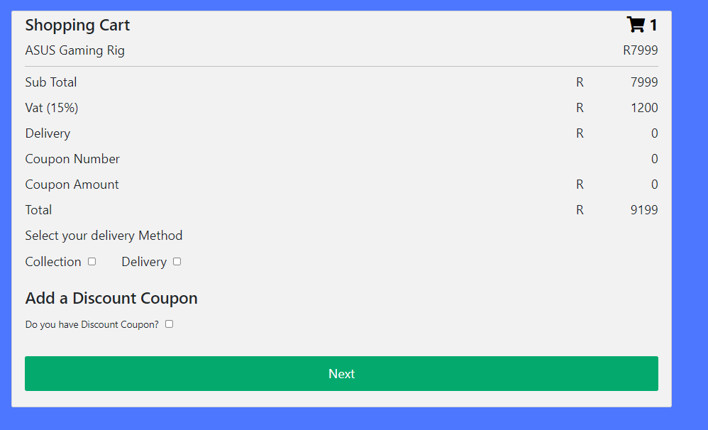
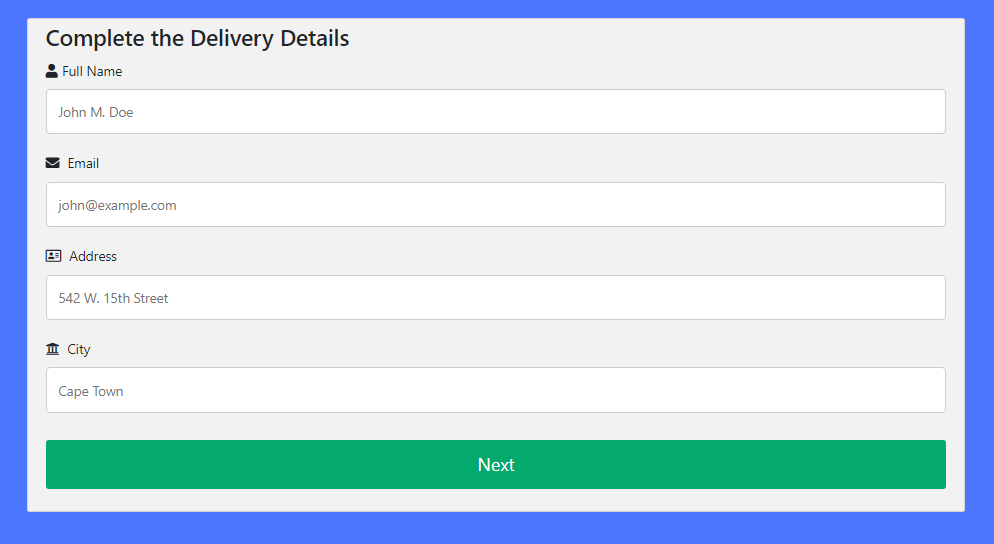
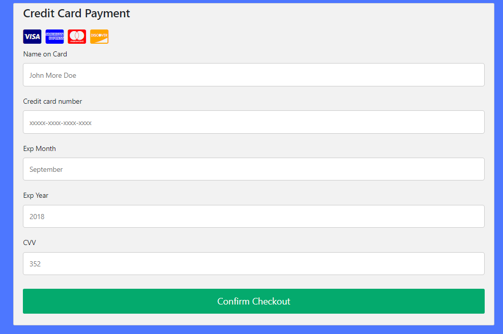
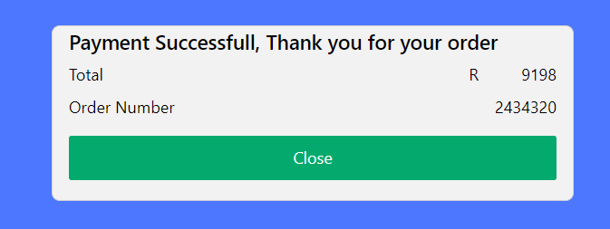

# L2T5-CAPSTONE-PROJECT
L2T5 Add Capstone Project L1T15 to Github

# Capstone Project

## Description

The store have 5 products to select from. The user can select a product and add the selected products to the cart for checkout. A user can also remove selected products and update their cart.

The user can click on the shopping cart in the Navbar which will display the number of products to view the shopping cart details. The user can also choose delivery options i.e. collect or delivery. Each option will direct the user to the checkout.

Finally, the user will receive an alert message with their purchase details and if the process was successfull.

## Installation Section

[1] The below link is the Github location of my project. The user can either clone the repository or dwnload the zip file to their local machine.

[2] https://github.com/SleepingWarrior/L2T5-CAPSTONE-PROJECT.git

[3] Run the folder in Visual Studio Code or similar IDE to view the code if required. The project can also open in the browser with /index.html. 

[3.1] Add Jquery and the JS links just before the closing body tag in the index.html file to run the project from the VSC editor 

``  
    <!-- jQuery -->
    

    <!-- Javascript -->
    
      
  ``

[4] Install Extension Live Server "ritwickdey.LiveServer" and run Live Server to view the website on your default browser.

## Usage Section

[1] The Site contain a Home Page, About Page, Contact Us Page and the ability to order and checkout your product.

### [1.1] Home Page

Select your product you are interested in to purchase.

### [1.2] About Page

All you need to know about us and you can leave a message and we will get back to you.

### [1.3] Contact Us Page

Complete the Contact page and Click Submit button once complete

### Product Checkout

[2] The user can select a product from the home page, in this case the ASUS Gaming Rig valued at R7999 excl vat was selected. The number of items will be displayed in the Navbar, in this case only 1 items was selected and number one is displayed.

[3] The user can click on the shopping cart in the Navbar to open the checkout process. The user can confirm the details of the selected items, price and the total amount. The delivery options are also available.

### Delivery Option

[4] The user can complete a delivery option and click next for the payment. If no delivery is selected the user will proceed to the payment.

### Payment

[5] The user complete the payment details and click next if everything is completed for the checkout page.

### Checkout

[6] The user will be notified if payment was successful, the amount and issued a unique order number for the purchase. Click on close to route the user back to the HomePage

### Direct to HomePage

[7] The user will be directed back to the hompage to place another order. The shopping cart will also be cleared at this stage.

## Credits

This is my own work, no other persons conntributed to the design.
